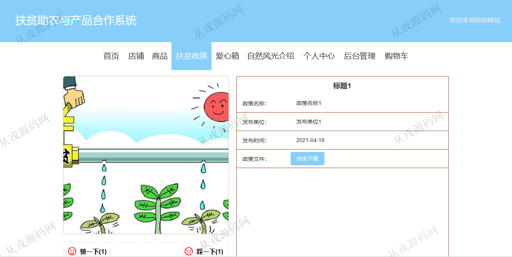

<h1 align="center">154.扶贫助农管理系统</h1>

- <b>完整代码获取地址：从戎源码网 ([https://armycodes.com/](https://armycodes.com/))</b>
- <b>技术探讨、资料分享，请加QQ群：692619798</b> 
- <b>作者微信：19941326836  QQ：952045282</b> 
- <b>承接计算机毕业设计、Java毕业设计、Python毕业设计、深度学习、机器学习</b>
- <b>选题+开题报告+任务书+程序定制+安装调试+论文+答辩ppt 一条龙服务</b>
- <b>所有选题地址 ([https://github.com/YuLin-Coder/AllProjectCatalog](https://github.com/YuLin-Coder/AllProjectCatalog)) </b>

## 项目介绍
基于springboot+vue的扶贫助农管理系统：前端 vue、element，后端 maven、springmvc、spring、mybatis；角色分为管理员、用户、店家；集成店铺、商品、扶贫政策等功能于一体的系统。

## 功能介绍

### 用户

- 基本功能：登录，注册，退出
- 网站首页：主导航栏，轮播图，商品推荐，自然风光介绍，商品展示，扶贫政策展示，爱心箱展示
- 商品购买：商品列表展示，商品搜索，商品详情，收藏，购物车，结算，在线支付
- 扶贫政策：政策列表展示，政策搜索，政策详情，政策文件下载，收藏，赞一下，踩一下
- 爱心箱：爱心箱列表站，按地区搜索，爱心箱详情，爱心捐赠

### 管理员

- 用户管理：用户信息的增删改查，用户信息主要由用户在前台自行注册而来，也可以由管理员后台添加
- 店家管理：店家信息的增删改查
- 店铺管理：店铺信息的增删改查，店铺图片上传
- 商品管理：商品信息的增删改查，商品图片上传，商品介绍支持富文本编辑
- 商品分类：分类信息的增删改查
- 生产地分类：生产地分类信息的增删改查
- 爱心捐赠管理：用户在前台的爱心捐赠，后台管理员可以查看捐赠记录
- 贫困店家申请管理：申请记录查询，申请资料下载查看，审核操作
- 扶贫政策管理：扶贫政策信息的增删改查，政策文件上传和下载，查看评论
- 订单管理；订单信息的列表查询，发货，退货操作

## 环境

- <b>IntelliJ IDEA 2021.3</b>

- <b>Mysql 5.7.26</b>

- <b>Node 14.14.0</b>

- <b>JDK 1.8</b>

## 运行截图

